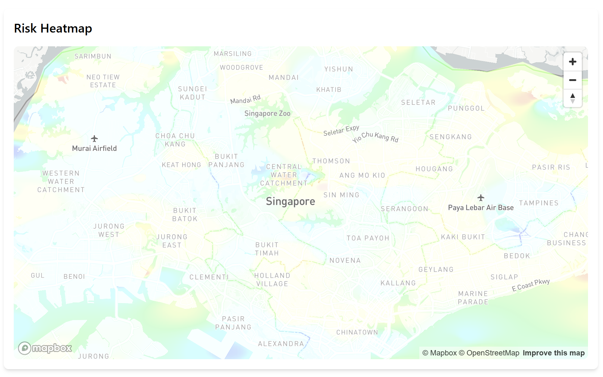
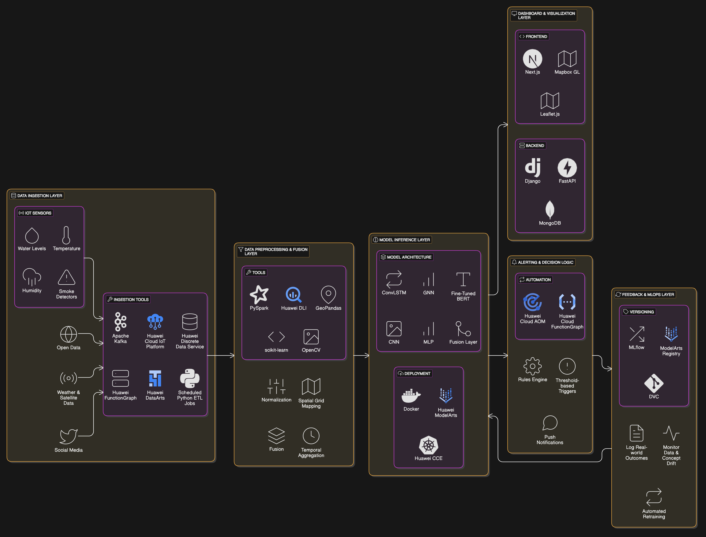

# AISDC 2025 - Huawei Track 1: Reinforce Public Safety and Emergency Response

## Project Overview
This repository contains our team's submission for the AI Student Developer Contest (AISDC) 2025 - Huawei Track 1. We present a cloud-based predictive emergency response system that transforms Singapore's incident management from reactive to proactive through advanced AI and data integration.

## Table of Contents
- [Executive Summary](#executive-summary)
- [Problem Statement](#problem-statement)
- [Solution Overview](#solution-overview)
- [Key Features](#key-features)
- [Technical Architecture](#technical-architecture)
- [Methodology](#methodology)
- [Getting Started](#getting-started)
- [Project Structure](#project-structure)
- [Impact](#impact)
- [Team Members](#team-members)
- [License](#license)

## Executive Summary
Our system empowers Singapore's emergency response capabilities by:
- Forecasting high-risk zones for crime, fire, and flash floods
- Integrating multiple data sources (IoT sensors, satellite imagery, social media)
- Applying advanced deep learning models (ConvLSTM, CNN, GNN, BERT)
- Providing real-time actionable insights for first responders
- Encouraging community self-regulation through passive data signals

## Problem Statement
Traditional emergency response systems face several key challenges:
- Lack of proactive prediction capabilities
- Poor integration of multi-source data
- Limited real-time coordination
- Delayed dispatch and inefficient resource allocation
- Insufficient situational awareness for first responders

## Solution Overview
Our cloud-based predictive emergency response system leverages deep learning to forecast high-risk areas and supports real-time coordination of first responders.

### Key Features
1. **Multi-modal Data Integration**
   - IoT sensor data (water level, temperature)
   - Open government datasets
   - Satellite imagery
   - Social media streams

2. **Advanced AI Models**
   - ConvLSTM for spatiotemporal modeling
   - CNN for image processing
   - GNN for spatial relationships
   - Fine-tuned BERT for social media analysis

3. **Dynamic Risk Mapping**
   - Zone-level risk scores
   - Confidence intervals
   - Real-time hotspot mapping

4. **Real-Time Dispatcher System**
   - Automated alerts
   - Agency notifications
   - Webhook integration
   - SMS alerts

5. **First Responder Dashboard**
   - Web-based interface
   - Live risk visualization
   - Sensor data integration
   - Action recommendations

### Sample Risk Heatmap

Below is a sample risk heatmap generated by our dashboard, showcasing real-time risk levels across different zones:



*Figure 1: Example of a risk heatmap visualizing high-risk zones for emergency response.*

## Technical Architecture
Our solution is built on Huawei Cloud with:
- Containerized microservices
- MLOps pipelines
- Automated model retraining
- Scalable infrastructure

### System Architecture Diagram


*Figure 2: High-level architecture of our predictive emergency response system*

## Methodology

### Fire and Flood Prediction
- Late fusion deep learning model
- Zone-based prediction (500m × 500m grid)
- Multi-modal data processing:
  - IoT sensor data through ConvLSTM
  - Weather forecasts via MLP
  - Static zone metadata
  - Satellite/radar imagery via CNN

### Crime Prediction
- Spatiotemporal deep learning
- Graph neural networks for zone interactions
- BERT-based social media analysis
- Dynamic risk scoring

## Getting Started

### Prerequisites
- Python 3.8+
- Docker
- Huawei Cloud account
- Required API access tokens

### Installation
```bash
# Clone the repository
git clone https://github.com/Saximn/naisc-2025.git
cd naisc-2025/website

# Configure environment variables
cp .env.example .env
# Edit .env with your API keys and configurations

# Build and run the Docker containers
docker-compose up -d

```

## Project Structure
```
aisdc-2025/
├── src/
│   ├── models/          # Deep learning models
│   ├── data/           # Data processing
│   ├── api/            # API endpoints
│   └── dashboard/      # Web interface
├── config/             # Configuration files
├── tests/             # Unit tests
├── docs/              # Documentation
└── README.md
```

## Impact
Our system delivers:
- Improved response times
- Better resource allocation
- Enhanced situational awareness
- Reduced incident impact
- Stronger community resilience
- Data-driven policy making
